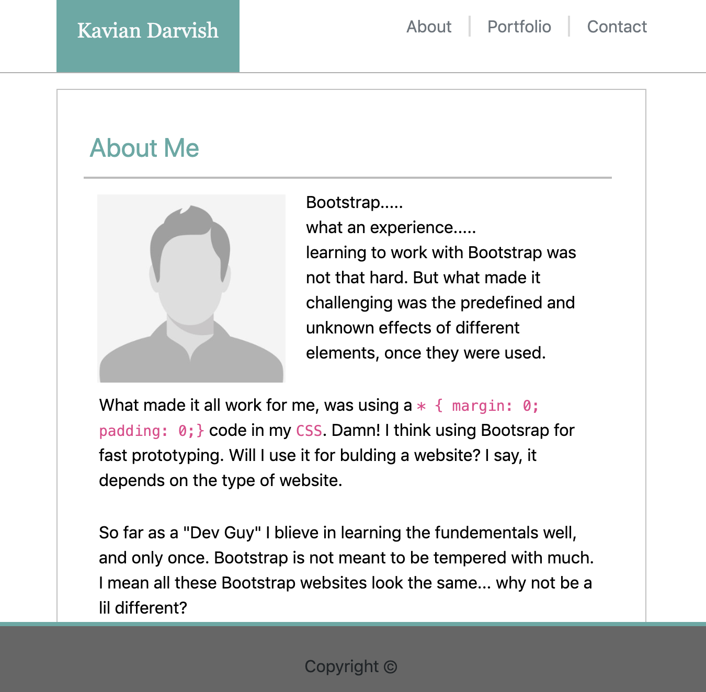

# Responsive-Portfolio
I will be using media queries in this Bootstrap project

Bootstrap.....
what an experience.....
learning to work with Bootstrap was not that hard. But what made it challenging was the predefined and unknown effects of different elements, once they were used.

What made it all work for me, was using a * { margin: 0; padding: 0;} code in my CSS. Damn! I think using Bootsrap for fast prototyping. Will I use it for bulding a website? I say, it depends on the type of website.

So far as a "Dev Guy" I blieve in learning the fundementals well, and only once. Bootstrap is not meant to be tempered with much. I mean all these Bootstrap websites look the same... why not be a lil different?

Yet, it is indeed powerful. PS. I like the Sticky Nav and Footer ;D

